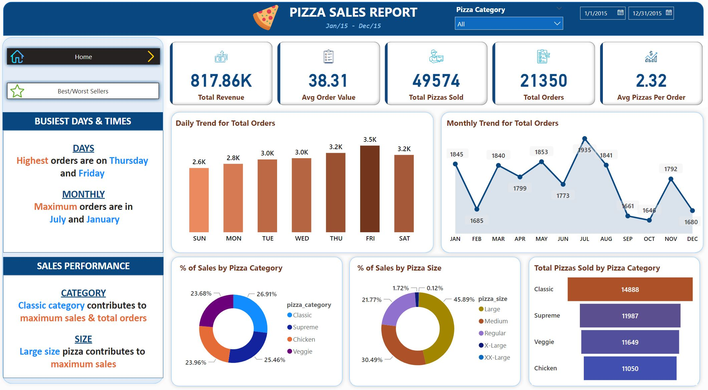
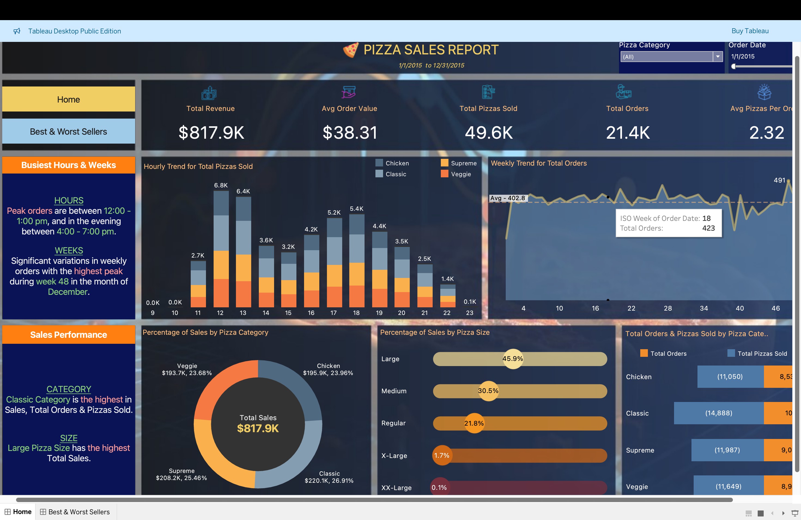
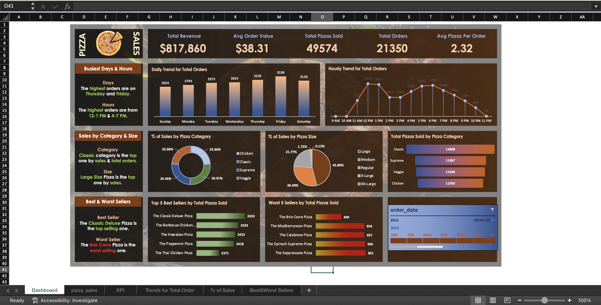

# Pizza-Sales-Dashboard
Interactive sales dashboards using Excel, Tableau, and Power BI
# 🍕 Pizza Sales Dashboard

An end-to-end **Pizza Sales Analysis Project** built using **SQL, Excel, Tableau, and Power BI** to deliver actionable business insights.

This project demonstrates skills in **data querying, processing, and visualization** by analyzing pizza sales trends and creating interactive dashboards for decision-making.

---

## 📂 Project Overview
This project showcases:
- ✅ **SQL** – for KPI calculations and trend analysis  
- ✅ **Excel** – for pivot tables and dashboards  
- ✅ **Power BI** – for interactive reports  
- ✅ **Tableau** – for advanced visual storytelling  

The goal was to analyze **Pizza Sales Data (2015)** (from Kaggle) and uncover **key insights into revenue, order trends, and product performance**.

---

## 🗂 Dataset
- **Source:** [Kaggle - Pizza Sales Dataset](https://www.kaggle.com/)  
- **Contents:**  
  - Order ID, Pizza Name, Category, Size  
  - Quantity Ordered, Total Price, Date & Time  

---

## 🎯 Problem Statement
The objective was to **analyze pizza sales performance** by answering:
- Which pizzas generate the most revenue?
- What are the best and worst-selling categories?
- When do most orders occur (daily, weekly, monthly)?
- What is the average order value?

---

## 📊 KPIs & Metrics
✅ **Total Revenue** – Total income generated from all pizza sales  
✅ **Average Order Value** – Total revenue ÷ total orders  
✅ **Total Pizzas Sold** – Total quantity of pizzas sold  
✅ **Total Orders** – Count of all unique orders  
✅ **Average Pizzas per Order** – Total pizzas ÷ total orders  

📈 **Trend & Category Analysis**
- Daily, Weekly & Monthly Sales Trends
- Sales by Pizza Category & Size
- Best & Worst-Selling Pizzas

---

## 🛠 Project Phases

### 1️⃣ SQL Analysis  
- Wrote SQL queries to calculate KPIs and trends.  
- Queries include revenue, orders, best sellers, and category analysis.  

---

### 2️⃣ Excel Dashboard  
- Created an interactive Excel dashboard using PivotTables & charts.  

---

### 3️⃣ Power BI Dashboard  
- Built an interactive Power BI dashboard with slicers and filters.  

---

### 4️⃣ Tableau Visualization  
- Developed Tableau dashboards with custom charts & advanced trend analysis.  

---

## 📸 Dashboard Previews

### Power BI Dashboard

### Tableau Dashboard

### Excel Dashboard

---

## 🏆 Conclusion
This project highlights the ability to:
- Extract & process data with **SQL**
- Build **interactive dashboards** in Excel, Power BI & Tableau
- Derive **actionable business insights** from raw sales data  

📌 A strong **portfolio piece** demonstrating **data analysis & visualization** skills.

---
